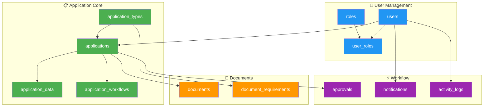

# 🗄️ SIKAP Database Documentation


## 📋 Table of Contents
- [🎯 Overview](#-overview)
- [🏗️ Database Schema](#️-database-schema)
- [🚀 Quick Start](#-quick-start)
- [📊 Visual ERD](#-visual-erd)
- [📁 File Structure](#-file-structure)
- [🔧 Setup Instructions](#-setup-instructions)

---

## 🎯 Overview

**SIKAP (Sistem Kerjasama Tana Tidung)** database dirancang untuk mendukung platform digital manajemen kerjasama Pemerintah Kabupaten Tana Tidung. Database ini mengelola seluruh lifecycle aplikasi kerjasama dari pengajuan hingga persetujuan.

### ✨ Key Features
- 🔐 **Role-based Access Control** - Multi-level permission system
- 📋 **Dynamic Application Forms** - Flexible form builder
- 📎 **Document Management** - Secure file upload & storage
- ⚡ **Workflow Engine** - Automated approval process
- 📊 **Real-time Analytics** - Dashboard metrics & reporting
- 🔍 **Full Audit Trail** - Complete activity logging

---

## 🏗️ Database Schema

### 📊 Table Statistics

| Category | Tables | Purpose |
|----------|--------|---------|
| 🔐 **User Management** | 3 tables | Authentication, roles, permissions |
| 📋 **Application Core** | 4 tables | Main business logic, forms, workflow |
| 📎 **Document Management** | 2 tables | File uploads, requirements |
| ⚡ **Workflow & Approval** | 3 tables | Reviews, notifications, audit |
| 📚 **Reference Data** | 4 tables | Master data, configurations |
| 📊 **Analytics** | 2 tables | Reports, dashboard statistics |

**Total: 18 tables** supporting complete cooperation management system.

---

## 🚀 Quick Start

### Prerequisites
- MySQL 8.0+ or MariaDB 10.5+
- PHP 8.1+ with PDO extension
- 10GB+ storage space
- Memory: 4GB+ recommended

### 1-Minute Setup
```bash
# Clone and setup
git clone <repository>
cd sikap-nextjs/database

# Run migrations
mysql -u root -p sikap < migrations/001_create_users_table.sql
# ... run all migration files in order

# Seed sample data
mysql -u root -p sikap < seeds/sample_data.sql

# Verify installation
mysql -u root -p sikap -e "SHOW TABLES;"
```

---

## 📊 Visual ERD

### 🎨 Color-Coded Schema
```
🔐 Blue    - User Management (users, roles, user_roles)
📋 Green   - Application Core (applications, application_types, etc.)
📎 Orange  - Document Management (documents, document_requirements)
⚡ Purple  - Workflow & Approval (approvals, notifications, activity_logs)
📚 Gray    - Reference Data (institutions, categories, settings)
📊 Yellow  - Analytics & Reporting (dashboard_stats, reports)
```

### 📈 Entity Relationships



---

## 📁 File Structure

```
database/
├── 📄 README.md              # This file
├── 📊 schema.md               # Complete ERD & documentation
├── 🗂️ migrations/             # SQL migration files
│   ├── 001_create_users_table.sql
│   ├── 002_create_roles_table.sql
│   ├── ...
│   └── 020_insert_seed_data.sql
├── 🌱 seeds/                  # Sample data
│   ├── sample_data.sql
│   ├── test_users.sql
│   └── demo_applications.sql
├── 📋 docs/                   # Additional documentation
│   ├── api_endpoints.md
│   ├── business_rules.md
│   └── performance_guide.md
└── 🔧 scripts/                # Utility scripts
    ├── backup.sh
    ├── restore.sh
    └── performance_test.sql
```

---

## 🔧 Setup Instructions

### Step 1: Database Creation
```sql
-- Create database
CREATE DATABASE sikap CHARACTER SET utf8mb4 COLLATE utf8mb4_unicode_ci;

-- Create user
CREATE USER 'sikap_user'@'localhost' IDENTIFIED BY 'your_secure_password';
GRANT ALL PRIVILEGES ON sikap.* TO 'sikap_user'@'localhost';
FLUSH PRIVILEGES;
```

### Step 2: Run Migrations
```bash
# Execute migrations in order
for file in migrations/*.sql; do
    echo "Executing $file..."
    mysql -u sikap_user -p sikap < "$file"
done
```

### Step 3: Seed Data
```bash
# Load sample data for development
mysql -u sikap_user -p sikap < seeds/sample_data.sql

# Load test users
mysql -u sikap_user -p sikap < seeds/test_users.sql

# Load demo applications (optional)
mysql -u sikap_user -p sikap < seeds/demo_applications.sql
```

### Step 4: Verify Installation
```sql
-- Check table count
SELECT COUNT(*) as table_count FROM information_schema.tables
WHERE table_schema = 'sikap';
-- Should return: 18

-- Check sample data
SELECT COUNT(*) as user_count FROM users;
SELECT COUNT(*) as role_count FROM roles;
SELECT COUNT(*) as application_type_count FROM application_types;
```

---

## 🔒 Security Configuration

### Required Settings
```sql
-- Enable slow query log
SET GLOBAL slow_query_log = 'ON';
SET GLOBAL long_query_time = 2;

-- Configure max connections
SET GLOBAL max_connections = 200;

-- Enable binary logging for replication
SET GLOBAL log_bin = 'ON';
```

### Environment Variables
```env
DB_HOST=localhost
DB_PORT=3306
DB_DATABASE=sikap
DB_USERNAME=sikap_user
DB_PASSWORD=your_secure_password
DB_CHARSET=utf8mb4
DB_COLLATION=utf8mb4_unicode_ci
```

---

## 📊 Performance Optimization

### Recommended Indexes
All critical indexes are included in `019_create_indexes.sql`:
- ✅ Primary key indexes (auto-created)
- ✅ Foreign key indexes for joins
- ✅ Composite indexes for complex queries
- ✅ Full-text indexes for search functionality

### Memory Configuration
```ini
# my.cnf recommendations for production
[mysqld]
innodb_buffer_pool_size = 2G
innodb_log_file_size = 256M
query_cache_size = 128M
max_connections = 200
```

---

## 🚨 Troubleshooting

### Common Issues

**❌ Migration fails with foreign key error**
```bash
# Solution: Disable foreign key checks temporarily
mysql -u root -p -e "SET FOREIGN_KEY_CHECKS = 0;"
# Run migration
mysql -u root -p -e "SET FOREIGN_KEY_CHECKS = 1;"
```

**❌ Large file uploads fail**
```sql
-- Increase MySQL limits
SET GLOBAL max_allowed_packet = 100M;
SET GLOBAL innodb_log_file_size = 256M;
```

**❌ Slow query performance**
```sql
-- Analyze slow queries
SELECT * FROM mysql.slow_log ORDER BY start_time DESC LIMIT 10;

-- Check index usage
EXPLAIN SELECT * FROM applications WHERE status = 'pending';
```

---

## 📞 Support & Contact

- 📧 **Technical Support**: developer@tanatidung.go.id
- 📖 **Documentation**: [Full Schema Documentation](./schema.md)
- 🐛 **Bug Reports**: Create GitHub issue
- 💡 **Feature Requests**: Contact development team

---

## 📝 Version History

| Version | Date | Changes |
|---------|------|---------|
| v1.0.0 | 2024-01 | Initial database schema |
| v1.1.0 | 2024-02 | Added document requirements |
| v1.2.0 | 2024-03 | Enhanced workflow system |

---

> 🚀 **Ready to build the future of government cooperation management!**
>
> This database schema supports scalable, secure, and efficient management of cooperation applications for Tana Tidung government.