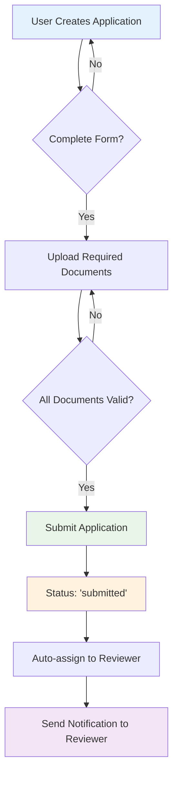
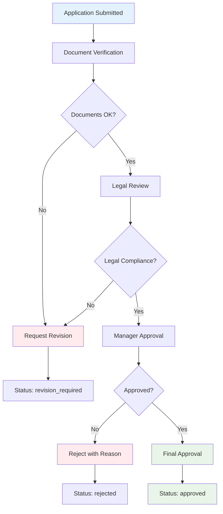
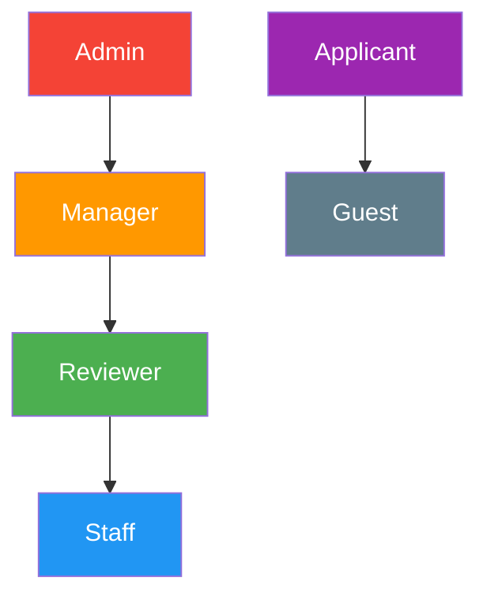

# 📋 SIKAP Business Rules & Workflow

## 🎯 Business Logic Overview

Dokumen ini menjelaskan aturan bisnis dan workflow yang harus diimplementasikan dalam aplikasi SIKAP berdasarkan analisis codebase.

---

## 🔄 Application Workflow

### 1. **Application Submission Flow**



### 2. **Review & Approval Process**



---

## 📋 Application Types & Requirements

### 1. **MOU (Memorandum of Understanding)**
```json
{
  "workflow_steps": [
    "document_verification",
    "legal_review",
    "approval_pending"
  ],
  "required_documents": [
    "suratPermohonan",
    "draftMou",
    "studiKelayakan",
    "profilKota",
    "legalStanding"
  ],
  "auto_assign": true,
  "deadline_days": 30,
  "approval_levels": 2
}
```

**Business Rules:**
- ✅ Semua 5 dokumen wajib diunggah
- ✅ Butuh 2 level persetujuan (reviewer + manager)
- ✅ Deadline default: 30 hari
- ✅ Auto-assign ke reviewer available

### 2. **PKS (Perjanjian Kerjasama)**
```json
{
  "workflow_steps": [
    "document_verification",
    "legal_review",
    "approval_pending"
  ],
  "required_documents": [
    "suratPermohonan",
    "draftPks"
  ],
  "auto_assign": true,
  "deadline_days": 45,
  "approval_levels": 2
}
```

**Business Rules:**
- ✅ Minimal 2 dokumen wajib
- ✅ Proses lebih formal dengan legal review
- ✅ Deadline lebih panjang: 45 hari
- ✅ Butuh persetujuan manager/admin

### 3. **Surat Kuasa & Nota Kesepakatan**
```json
{
  "workflow_steps": [
    "document_verification",
    "approval_pending"
  ],
  "required_documents": [
    "suratPermohonan",
    "draftPks"
  ],
  "auto_assign": true,
  "deadline_days": 21,
  "approval_levels": 1
}
```

**Business Rules:**
- ✅ Proses lebih cepat, tanpa legal review
- ✅ Deadline pendek: 21 hari
- ✅ 1 level persetujuan saja

---

## 👥 User Roles & Permissions

### 1. **Role Hierarchy**


### 2. **Permission Matrix**

| Action | Admin | Manager | Reviewer | Staff | Applicant |
|--------|-------|---------|----------|-------|-----------|
| 👀 View All Applications | ✅ | ✅ | ✅ | ✅ | ❌ |
| 📝 Create Application | ✅ | ✅ | ✅ | ❌ | ✅ |
| ✅ Approve Application | ✅ | ✅ | ❌ | ❌ | ❌ |
| 📋 Review Application | ✅ | ✅ | ✅ | ❌ | ❌ |
| 👥 Manage Users | ✅ | ✅ | ❌ | ❌ | ❌ |
| 📊 Generate Reports | ✅ | ✅ | ✅ | ✅ | ❌ |
| ⚙️ System Settings | ✅ | ❌ | ❌ | ❌ | ❌ |
| 📎 Upload Documents | ✅ | ✅ | ✅ | ❌ | ✅ |

---

## 🔔 Notification Rules

### 1. **Automatic Notifications**
```sql
-- When application submitted
INSERT INTO notifications (user_id, title, message, type, action_url, related_id)
SELECT ur.user_id, 'Permohonan Baru',
       CONCAT('Permohonan ', a.title, ' memerlukan review'),
       'application_review',
       CONCAT('/dashboard/applications/', a.id),
       a.id
FROM applications a, user_roles ur, roles r
WHERE a.id = NEW.id
  AND ur.role_id = r.id
  AND r.name IN ('reviewer', 'manager')
  AND a.status = 'submitted'
```

### 2. **Deadline Warnings**
```sql
-- Daily cron job for deadline reminders
INSERT INTO notifications (user_id, title, message, type, action_url, related_id)
SELECT a.assigned_to, 'Deadline Mendekat',
       CONCAT('Permohonan #', a.id, ' deadline dalam 2 hari'),
       'deadline_warning',
       CONCAT('/dashboard/applications/', a.id),
       a.id
FROM applications a
WHERE a.due_date = DATE_ADD(CURDATE(), INTERVAL 2 DAY)
  AND a.status IN ('submitted', 'in_review', 'document_verification')
  AND a.assigned_to IS NOT NULL
```

### 3. **Status Change Notifications**
```sql
-- When status changes to approved/rejected
INSERT INTO notifications (user_id, title, message, type, action_url, related_id)
VALUES (
  NEW.user_id,
  CASE
    WHEN NEW.status = 'approved' THEN 'Permohonan Disetujui'
    WHEN NEW.status = 'rejected' THEN 'Permohonan Ditolak'
    ELSE 'Status Permohonan Berubah'
  END,
  CONCAT('Permohonan "', NEW.title, '" telah ', NEW.status),
  'status_change',
  CONCAT('/applications/', NEW.id),
  NEW.id
)
```

---

## 📊 Dashboard Business Rules

### 1. **Real-time Statistics**
```sql
-- Update dashboard stats every hour
-- Performance metrics that matter:

SELECT
  COUNT(*) as total_applications,
  COUNT(CASE WHEN DATE(submitted_at) = CURDATE() THEN 1 END) as today_count,
  COUNT(CASE WHEN status = 'submitted' THEN 1 END) as pending_count,
  COUNT(CASE WHEN status = 'approved' THEN 1 END) as approved_count,
  COUNT(CASE WHEN status = 'rejected' THEN 1 END) as rejected_count,
  AVG(DATEDIFF(
    COALESCE(approved_at, rejected_at),
    submitted_at
  )) as avg_processing_days
FROM applications
WHERE submitted_at >= DATE_SUB(NOW(), INTERVAL 1 YEAR)
```

### 2. **Performance KPIs**
- ⏱️ **Average Processing Time**: Target < 15 hari
- 📈 **Approval Rate**: Target > 80%
- 🎯 **On-time Completion**: Target > 90%
- 📋 **Application Volume**: Track monthly trends

---

## 🔐 Security & Validation Rules

### 1. **File Upload Security**
```php
// Business rules for file uploads
$allowed_types = ['pdf', 'doc', 'docx', 'jpg', 'jpeg', 'png'];
$max_file_size = 5 * 1024 * 1024; // 5MB
$virus_scan_required = true;
$filename_sanitization = true;

// Validation rules
if (!in_array($file_extension, $allowed_types)) {
    throw new ValidationException('File type not allowed');
}

if ($file_size > $max_file_size) {
    throw new ValidationException('File size exceeds limit');
}

// Store in secure directory outside web root
$secure_path = '/uploads/documents/' . date('Y/m/d/');
```

### 2. **Data Access Rules**
```sql
-- Users can only see their own applications (unless admin/reviewer)
SELECT * FROM applications
WHERE id = ?
  AND (user_id = ? OR ? IN (
    SELECT role_id FROM user_roles ur
    JOIN roles r ON ur.role_id = r.id
    WHERE ur.user_id = ?
    AND r.name IN ('admin', 'reviewer', 'manager')
  ))
```

### 3. **Audit Trail Requirements**
```sql
-- Log all critical actions
INSERT INTO activity_logs (user_id, entity_type, entity_id, action, description, ip_address, user_agent)
VALUES (?, ?, ?, ?, ?, ?, ?)

-- Required for:
-- - Application status changes
-- - Document uploads/deletions
-- - User role assignments
-- - Settings modifications
-- - Report generations
```

---

## 📋 Form Validation Rules

### 1. **Application Form Validation**
```javascript
// From codebase analysis - permohonan page validation
const validationRules = {
  nama: { required: true, minLength: 2, maxLength: 255 },
  email: { required: true, format: 'email' },
  contactPerson: { required: true, format: 'phone' },
  instansi: { required: true, minLength: 2 },
  keperluan: { required: true, minLength: 10 },
  tentang: { required: true, minLength: 20 },
  catatan: { required: false, maxLength: 1000 }
}

// File validation per type
const fileValidation = {
  mou: {
    suratPermohonan: { required: true },
    draftMou: { required: true },
    studiKelayakan: { required: true },
    profilKota: { required: true },
    legalStanding: { required: true }
  },
  pks: {
    suratPermohonan: { required: true },
    draftPks: { required: true }
  }
}
```

### 2. **Email Format Validation**
```javascript
// From codebase: email regex validation
const emailRegex = /^[^\s@]+@[^\s@]+\.[^\s@]+$/;
const phoneRegex = /^[\+]?[0-9\s\-\(\)]{10,}$/;
```

---

## 🚨 Error Handling Rules

### 1. **Application Submission Errors**
```json
{
  "incomplete_form": "Form belum lengkap, harap isi semua field wajib",
  "missing_documents": "Dokumen wajib belum diunggah: {document_list}",
  "file_too_large": "Ukuran file tidak boleh lebih dari 5MB",
  "invalid_file_type": "Format file tidak didukung. Gunakan PDF, DOC, atau DOCX",
  "virus_detected": "File mengandung virus, silakan scan terlebih dahulu",
  "server_error": "Terjadi kesalahan sistem, silakan coba lagi atau hubungi admin"
}
```

### 2. **Permission Errors**
```json
{
  "access_denied": "Anda tidak memiliki akses untuk melakukan tindakan ini",
  "application_not_found": "Permohonan tidak ditemukan atau telah dihapus",
  "document_access_denied": "Anda tidak memiliki akses untuk melihat dokumen ini",
  "role_required": "Tindakan ini memerlukan role {required_role}"
}
```

---

## 📈 Reporting Business Rules

### 1. **Standard Reports**
- 📊 **Weekly Activity Report**: Otomatis generate setiap Senin
- 📈 **Monthly Performance Report**: Generate tanggal 1 setiap bulan
- 📋 **Quarterly Trend Analysis**: Generate setiap awal kuartal
- 🎯 **Annual Summary Report**: Generate 1 Januari

### 2. **Custom Report Parameters**
```sql
-- Flexible reporting with parameters
SELECT /* fields based on report_type */
FROM applications a
JOIN /* tables based on report_scope */
WHERE a.submitted_at BETWEEN ? AND ?
  AND (? IS NULL OR a.status = ?)
  AND (? IS NULL OR a.application_type_id = ?)
  AND (? IS NULL OR a.institution_id = ?)
GROUP BY /* grouping based on report_type */
ORDER BY /* sorting based on report_type */
```

---

> 💡 **Note**: Business rules ini dirancang berdasarkan analisis codebase SIKAP dan best practices untuk sistem approval pemerintah. Implementasi dapat disesuaikan dengan kebutuhan spesifik Kabupaten Tana Tidung.