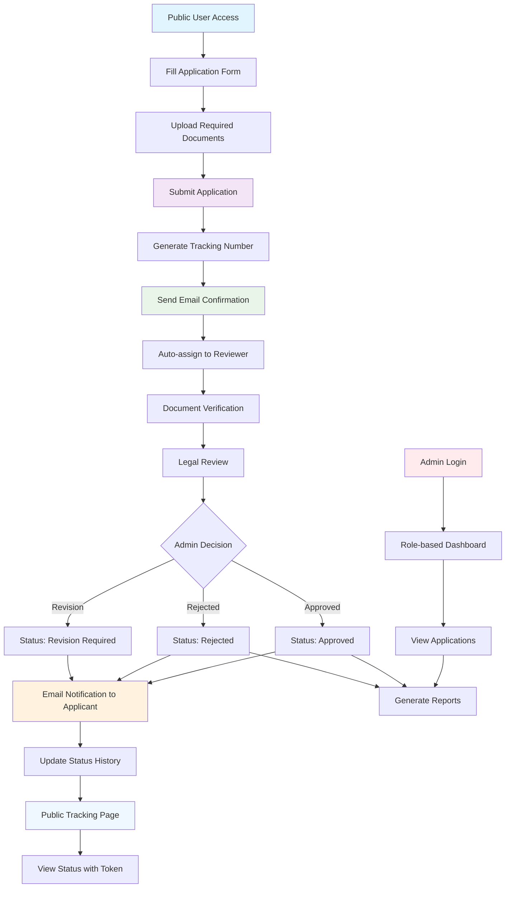

# 📊 SIKAP Database Schema

## 🎯 Overview
Database schema untuk **SIKAP (Sistem Kerjasama Tana Tidung)** - platform digital untuk manajemen kerjasama Pemerintah Kabupaten Tana Tidung.

---

## 🏗️ Entity Relationship Diagram (ERD)

```mermaid
erDiagram
    %% User Management (Admin Only)
    users ||--o{ user_roles : has
    roles ||--o{ user_roles : assigned_to
    users ||--o{ applications : reviews_admin
    users ||--o{ notifications : receives
    users ||--o{ activity_logs : performs

    %% Public Application Management
    applications ||--o{ application_data : contains
    applications ||--o{ documents : has
    applications ||--o{ application_workflows : follows
    applications ||--o{ approvals : reviewed_by
    applications ||--o{ application_status_history : tracks
    applications ||--|| public_submissions : public_tracking
    application_types ||--o{ applications : defines
    application_types ||--o{ document_requirements : requires

    %% Progress Tracking for Public
    public_submissions ||--o{ email_notifications : receives
    public_submissions ||--o{ status_updates : gets

    %% Workflow & Documents
    documents }o--|| document_requirements : satisfies
    users ||--o{ approvals : reviews
    users ||--o{ documents : uploads_admin

    %% Reference Data
    institutions ||--o{ applications : cooperates_with
    cooperation_categories ||--o{ applications : categorizes
    legal_documents ||--o{ applications : references

    %% Analytics
    users ||--o{ reports : generates
    dashboard_stats }o--|| users : tracked_for

    %% Entities Definition
    users {
        bigint id PK
        string email UK
        string username UK
        string password_hash
        string full_name
        string phone
        enum status
        timestamp created_at
        timestamp updated_at
        timestamp email_verified_at
    }

    roles {
        int id PK
        string name UK
        string description
        json permissions_json
        timestamp created_at
        timestamp updated_at
    }

    user_roles {
        bigint id PK
        bigint user_id FK
        int role_id FK
        bigint assigned_by FK
        timestamp assigned_at
        timestamp expires_at
    }

    applications {
        bigint id PK
        bigint user_id FK "nullable - for admin created"
        int application_type_id FK
        bigint institution_id FK
        int cooperation_category_id FK
        string tracking_number UK "for public tracking"
        string public_token UK "secure token for access"
        string title
        text description
        text purpose
        text about
        text notes
        string contact_person
        string contact_email
        string contact_phone
        string institution_name
        enum status
        enum priority
        timestamp submitted_at
        timestamp updated_at
        bigint assigned_to FK
        timestamp due_date
        boolean is_public_submission
    }

    application_types {
        int id PK
        string code UK
        string name
        text description
        json required_documents_json
        json workflow_steps_json
        boolean active
        timestamp created_at
        timestamp updated_at
    }

    application_data {
        bigint id PK
        bigint application_id FK
        string field_key
        text field_value
        string field_type
        timestamp created_at
        timestamp updated_at
    }

    application_workflows {
        bigint id PK
        bigint application_id FK
        string step_name
        enum status
        bigint assigned_to FK
        timestamp completed_at
        text notes
        timestamp created_at
    }

    documents {
        bigint id PK
        bigint application_id FK
        int document_requirement_id FK
        string original_filename
        string stored_filename
        string file_path
        bigint file_size
        string mime_type
        bigint uploaded_by FK
        timestamp uploaded_at
        string document_type
    }

    document_requirements {
        int id PK
        int application_type_id FK
        string document_name
        boolean is_required
        string allowed_formats
        bigint max_file_size
        text description
        timestamp created_at
        timestamp updated_at
    }

    approvals {
        bigint id PK
        bigint application_id FK
        bigint reviewer_id FK
        enum status
        text comments
        timestamp reviewed_at
        timestamp created_at
    }

    notifications {
        bigint id PK
        bigint user_id FK
        string title
        text message
        enum type
        timestamp read_at
        timestamp created_at
        string action_url
        bigint related_id
    }

    activity_logs {
        bigint id PK
        bigint user_id FK
        string entity_type
        bigint entity_id
        string action
        text description
        string ip_address
        string user_agent
        timestamp created_at
    }

    institutions {
        int id PK
        string name
        enum type
        string code UK
        text address
        string contact_person
        string phone
        string email
        boolean active
        timestamp created_at
        timestamp updated_at
    }

    cooperation_categories {
        int id PK
        string name
        text description
        string icon
        boolean active
        int sort_order
        timestamp created_at
        timestamp updated_at
    }

    legal_documents {
        int id PK
        string title
        string document_number UK
        string year
        string category
        string file_path
        text description
        timestamp created_at
        timestamp updated_at
    }

    settings {
        int id PK
        string key UK
        text value
        text description
        enum type
        timestamp created_at
        timestamp updated_at
    }

    dashboard_stats {
        bigint id PK
        string stat_key
        string stat_value
        date date
        timestamp created_at
    }

    reports {
        bigint id PK
        bigint generated_by FK
        string report_type
        json parameters_json
        string file_path
        timestamp generated_at
        timestamp expires_at
    }

    public_submissions {
        bigint id PK
        bigint application_id FK
        string tracking_number UK
        string public_token UK
        string contact_email
        string contact_phone
        string contact_person
        timestamp last_accessed
        boolean email_notifications_enabled
        timestamp created_at
    }

    application_status_history {
        bigint id PK
        bigint application_id FK
        string previous_status
        string new_status
        bigint changed_by FK "nullable - system or admin"
        text notes
        timestamp changed_at
        boolean notify_applicant
    }

    email_notifications {
        bigint id PK
        bigint application_id FK
        string recipient_email
        string subject
        text message
        enum status "pending,sent,failed,bounced"
        string notification_type
        timestamp sent_at
        timestamp created_at
        text error_message
    }
```



---

## 🎨 Table Categories

### 🔐 **User Management (Admin Only)** (Blue)
- `users` - Admin user accounts and authentication
- `roles` - Role definitions and permissions
- `user_roles` - User-role assignments

### 📋 **Application Core** (Green)
- `applications` - Main application records (public + admin)
- `application_types` - Types of cooperation (MOU, PKS, etc.)
- `application_data` - Dynamic form data
- `application_workflows` - Workflow tracking

### 🌐 **Public Submission System** (Cyan)
- `public_submissions` - Public submission tracking and contact info
- `application_status_history` - Status change tracking for notifications
- `email_notifications` - Email notification queue and history

### 📎 **Document Management** (Orange)
- `documents` - File uploads and attachments
- `document_requirements` - Required documents per type

### ⚡ **Workflow & Approval** (Purple)
- `approvals` - Approval history and decisions
- `notifications` - System notifications (admin only)
- `activity_logs` - Audit trail

### 📚 **Reference Data** (Gray)
- `institutions` - Government and partner institutions
- `cooperation_categories` - Cooperation categories
- `legal_documents` - Legal basis and regulations
- `settings` - System configuration

### 📊 **Analytics & Reporting** (Yellow)
- `dashboard_stats` - Performance metrics
- `reports` - Generated reports

---

## 🔄 Data Flow Diagram



---

## 🔍 Key Features & Business Logic

### 1. **Application Types**
```sql
-- Supported cooperation types from codebase analysis
INSERT INTO application_types (code, name, description) VALUES
('mou', 'Memorandum of Understanding', 'Perjanjian tidak mengikat secara hukum'),
('pks', 'Perjanjian Kerjasama', 'Perjanjian formal yang mengikat'),
('surat_kuasa', 'Surat Kuasa', 'Delegasi wewenang untuk representasi'),
('nota_kesepakatan', 'Nota Kesepakatan', 'Kesepahaman dasar sebelum perjanjian formal');
```

### 2. **User Roles & Permissions**
```sql
-- Role hierarchy
INSERT INTO roles (name, description, permissions_json) VALUES
('admin', 'System Administrator', '["all"]'),
('reviewer', 'Application Reviewer', '["applications.review", "applications.approve"]'),
('staff', 'Government Staff', '["applications.view", "reports.generate"]'),
('applicant', 'External Applicant', '["applications.create", "applications.edit_own"]');
```

### 3. **Application Status Flow**
```sql
-- Status progression
ENUM application_status:
'draft' → 'submitted' → 'in_review' → 'approved'/'rejected'/'revision_required'
```

---

## 📋 Indexing Strategy

### Primary Indexes
```sql
-- Performance critical indexes
CREATE INDEX idx_applications_user_status ON applications(user_id, status);
CREATE INDEX idx_applications_type_status ON applications(application_type_id, status);
CREATE INDEX idx_applications_submitted_at ON applications(submitted_at DESC);
CREATE INDEX idx_documents_application_id ON documents(application_id);
CREATE INDEX idx_activity_logs_user_created ON activity_logs(user_id, created_at DESC);
CREATE INDEX idx_notifications_user_read ON notifications(user_id, read_at);

-- Full-text search indexes
CREATE FULLTEXT INDEX idx_applications_search ON applications(title, description);
CREATE FULLTEXT INDEX idx_documents_search ON documents(original_filename);
```

### Composite Indexes
```sql
-- Multi-column indexes for complex queries
CREATE INDEX idx_applications_complex ON applications(status, priority, submitted_at DESC);
CREATE INDEX idx_user_roles_active ON user_roles(user_id, role_id, expires_at);
```

---

## 🚀 Migration Sequence

### Phase 1: Core Structure
1. `001_create_users_table.sql`
2. `002_create_roles_table.sql`
3. `003_create_user_roles_table.sql`
4. `004_create_institutions_table.sql`
5. `005_create_cooperation_categories_table.sql`

### Phase 2: Application Management
6. `006_create_application_types_table.sql`
7. `007_create_applications_table.sql`
8. `008_create_application_data_table.sql`
9. `009_create_application_workflows_table.sql`

### Phase 3: Documents & Approval
10. `010_create_document_requirements_table.sql`
11. `011_create_documents_table.sql`
12. `012_create_approvals_table.sql`

### Phase 4: System Features
13. `013_create_notifications_table.sql`
14. `014_create_activity_logs_table.sql`
15. `015_create_settings_table.sql`
16. `016_create_legal_documents_table.sql`

### Phase 5: Analytics
17. `017_create_dashboard_stats_table.sql`
18. `018_create_reports_table.sql`
19. `019_create_indexes.sql`
20. `020_insert_seed_data.sql`

---

## 🔐 Security Considerations

### Data Protection
- ✅ **Password Hashing**: bcrypt/argon2 for user passwords
- ✅ **File Upload Security**: Virus scanning, type validation, size limits
- ✅ **SQL Injection Prevention**: Parameterized queries, ORM usage
- ✅ **Access Control**: Role-based permissions, row-level security

### Audit & Compliance
- ✅ **Activity Logging**: All CRUD operations logged with user context
- ✅ **Data Retention**: Configurable retention policies for logs and files
- ✅ **GDPR Compliance**: User data deletion capabilities
- ✅ **Backup Strategy**: Regular backups with encryption

---

## 📊 Estimated Storage Requirements

| Table Category | Estimated Rows/Year | Storage/Row | Total Storage |
|----------------|---------------------|-------------|---------------|
| Applications | 5,000 | 2KB | 10MB |
| Documents | 25,000 | 5MB avg | 125GB |
| Activity Logs | 500,000 | 1KB | 500MB |
| Users | 1,000 | 1KB | 1MB |
| **Total** | | | **~126GB/year** |

---

> 💡 **Note**: Schema ini dirancang untuk mendukung pertumbuhan data hingga 10 tahun dengan performa optimal. Gunakan partitioning untuk tabel log yang besar.